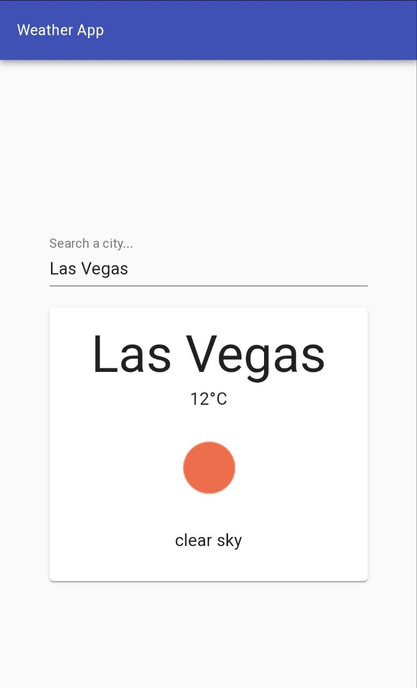
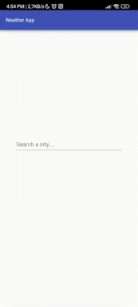
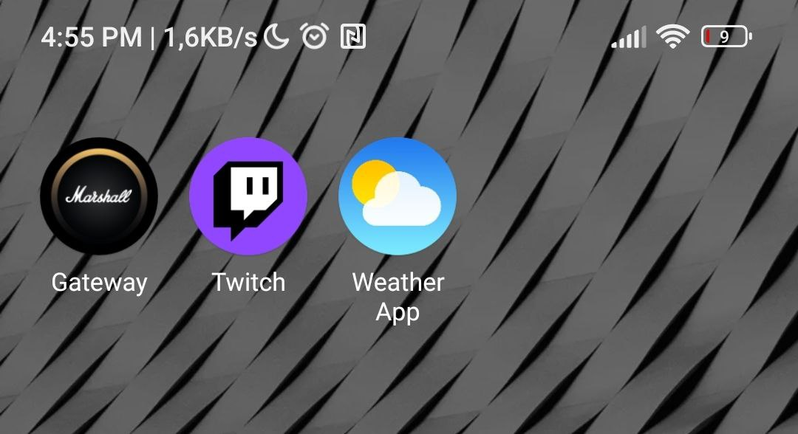

# Weather App
Weather app is a progressive web application built using React.js, Material UI and the WeatherAPI. It is s a website that looks and behaves as if it is a mobile app,  

Link: [Weather App](https://ed-weather-app.netlify.app/)

Images and Videos:
 

    

    

 
    

The app can be download directly from the web browser.

